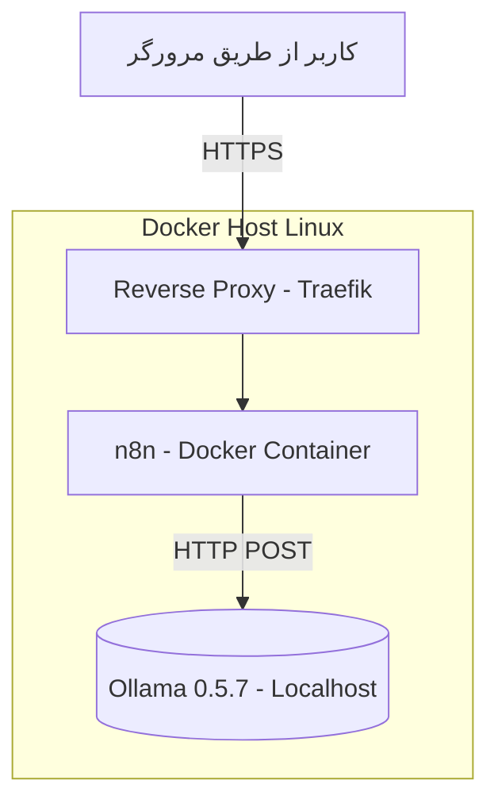

<div dir='rtl'>

# n8n & Ollama & DeepSeek on local by Docker


## 1. معرفی پروژه (Project Overview)

این پروژه اتصال بین ابزار اتوماسیون ورک‌فلو **n8n** (که درون Docker و پشت reverse proxy مانند **Traefik** اجرا می‌شود) و مدل‌های هوش مصنوعی اجراشده توسط **Ollama (نسخه 0.5.7)** روی سیستم لوکال لینوکسی را فراهم می‌کند.

هدف از این اتصال، اجرای خودکار promptهای AI از داخل n8n و دریافت پاسخ‌های هوشمند از مدل‌هایی مانند `deepseek-r1:1.5b` است.

---

## 2. نصب و راه‌اندازی Ollama و DeepSeek 

### 2.1 نصب Ollama

Ollama ابزاری برای مدیریت و اجرای مدل‌های زبان بزرگ (LLM) به‌صورت محلی است. این ابزار با استفاده از Docker، امکان اجرای مدل‌هایی مانند DeepSeek با سایزهای مختلف (7B, 8B, 14B, 32B, 70B) را فراهم می‌کند. مناسب برای پروژه‌های تحقیقاتی، تحلیل داده، پاسخ‌های خودکار، و برنامه‌های NLP بدون نیاز به اینترنت یا سرویس ابری.

#### نصب Ollama در لینوکس:

```bash
curl -sSL https://ollama.com/install.sh | sh
```

#### بررسی نسخه:

```bash
ollama --version
```

انتظار خروجی:

```bash
ollama version is 0.5.7
```

---

### 2.2 دانلود مدل DeepSeek

#### دستور دانلود:

```bash
ollama pull deepseek-r1:1.5b
```

#### دانلود سایر مدل‌ها:

```bash
ollama pull deepseek-r1:7b
ollama pull deepseek-r1:8b
ollama pull deepseek-r1:14b
```

#### مشاهده مدل‌های دانلود شده:

```bash
ollama list
```

#### پیشنهاد انتخاب مدل:

* اگر سخت‌افزار ضعیف دارید: مدل‌های 7B یا 8B
* برای تحقیقات سنگین: مدل‌های 32B یا 70B

بیشتر بخوانید: [https://ollama.com/library/deepseek-r1](https://ollama.com/library/deepseek-r1)

---

### 2.3 اجرای مدل در ترمینال

```bash
ollama run deepseek-r1:1.5b
```

این دستور مدل را اجرا کرده و منتظر prompt شما می‌ماند.

---

### 2.4 استفاده از Ollama در اسکریپت پایتون

#### ساخت و فعال‌سازی محیط مجازی:

```bash
python3 -m venv ENVDEEPSEEK
source ENVDEEPSEEK/bin/activate
```

#### نصب پکیج:

```bash
pip install ollama
```

[لینک گیت‌هاب](https://github.com/ollama/ollama-python)

#### اسکریپت نمونه:


</div>

```python
import ollama

model = 'deepseek-r1:1.5b'
question = 'How do you see the future of software design with the emergence of AI and current trends?'

response = ollama.chat(model=model, messages=[
    {
        'role': 'user',
        'content': question,
    },
])

ollama_response = response['message']['content']

print(ollama_response)

with open("OutputOllama.txt", "w", encoding="utf-8") as text_file:
    text_file.write(ollama_response)
```


<div dir='rtl'>

#### اجرای اسکریپت:

```bash
python deepseek_example.py
```

#### خروجی نمونه پاسخ مدل:

> Designing a software system that integrates AI... *(خروجی کامل در مستند بالا توضیح داده شده)*

---

## 3. نمودار معماری سیستم (System Architecture)



---

## 4. اجزای اصلی سیستم (Component Breakdown)

### 📌 Ollama (Local)

* اجرا روی سیستم لوکال با نسخه 0.5.7
* سرویس‌دهی روی پورت `11434`
* مدل `deepseek-r1:1.5b` بارگذاری شده

### 📌 n8n (Docker)

* اجرا به‌صورت container
* ذخیره داده‌ها در مسیر `./data/n8n`
* استفاده از `extra_hosts` برای دسترسی به `host.docker.internal`

### 📌 Traefik (Docker)

* به‌عنوان reverse proxy برای دسترسی TLS
* مدیریت گواهی‌های Let’s Encrypt با email و تنظیمات امنیتی

### 📌 Docker Compose

* مدیریت کل سرویس‌ها
* اتصال اجزا از طریق volume و شبکه

... (بخش‌های دیگر بدون تغییر باقی می‌مانند)


## 4.1 فایل `.env`

```dotenv
DOMAIN_NAME=example.com
SUBDOMAIN=n8n
GENERIC_TIMEZONE=Europe/Berlin
SSL_EMAIL=user@example.com
```

| متغیر             | توضیح                                        |
| ----------------- | -------------------------------------------- |
| DOMAIN\_NAME      | دامنه اصلی برای n8n                          |
| SUBDOMAIN         | ساب‌دامین مثلاً n8n.example.com              |
| GENERIC\_TIMEZONE | منطقه زمانی اجرای زمان‌بندی                  |
| SSL\_EMAIL        | ایمیل برای دریافت گواهی TLS از Let's Encrypt |

---

## 5. پیکربندی `docker-compose.yml`

### 🎯 تنظیم مسیر داده n8n

```yaml
volumes:
  - ./data/n8n:/home/node/.n8n
```

### 🎯 استفاده از `extra_hosts`

```yaml
extra_hosts:
  - "host.docker.internal:host-gateway"
```

### 🎯 تعریف Traefik

</div>

```yaml
ports:
  - "88:80"
  - "443:443"
labels:
  - traefik.enable=true
  - traefik.http.routers.n8n.rule=Host(`${SUBDOMAIN}.${DOMAIN_NAME}`)
  ...
```

<div dir='rtl'>
---

## 6. تنظیم Credential در n8n برای Ollama

در n8n:

1. به بخش **Credentials** بروید
2. یک Credential جدید از نوع **HTTP Basic API** بسازید
3. مقدار URL را وارد کنید:

   ```
   http://host.docker.internal:11434
   ```
4. اگر نیاز به احراز هویت نیست، فیلدهای username/password را خالی بگذارید

---

## 7. نمونه تست پرامپت

در n8n یک node از نوع **HTTP Request** ایجاد کنید:

### مشخصات:

* Method: POST
* URL: `http://host.docker.internal:11434/api/generate`
* Headers:

  ```json
  {
    "Content-Type": "application/json"
  }
  ```
* Body (Raw, JSON):

  ```json
  {
    "model": "deepseek-r1:1.5b",
    "prompt": "سلام دنیا"
  }
  ```

---

## 8. عیب‌یابی (Troubleshooting)

| مشکل                           | راه‌حل                                                                              |
| ------------------------------ | ----------------------------------------------------------------------------------- |
| اتصال از n8n به Ollama قطع است | بررسی `host.docker.internal` در لینوکس → اضافه کردن `extra_hosts` با `host-gateway` |
| Ollama پاسخ نمی‌دهد            | اجرای مجدد سرویس با `ollama run model_name`                                         |
| مدل وجود ندارد                 | بررسی با `ollama list` و در صورت نیاز `ollama pull model_name`                      |

---

## 9. نکات امنیتی برای محیط Production

* غیرفعال‌سازی `--api.insecure=true` در Traefik
* محدود کردن دسترسی به پورت 11434 با فایروال
* اجرای n8n پشت احراز هویت (Basic Auth فعال است)
* استفاده از SSL واقعی و نگهداری امن `credentials`

---

## 10. پشتیبانی از UTF-8

تمام تبادل‌های متنی با مدل و نمایش در n8n با **UTF-8** انجام می‌شود.
اطمینان حاصل شود که درخواست‌ها دارای header زیر باشند:

```http
Content-Type: application/json; charset=UTF-8
```

و مدل‌ها مانند DeepSeek به‌درستی از متن فارسی پشتیبانی می‌کنند.

---

## ✅ نتیجه‌گیری

این مستند یک راهنمای کامل برای اتصال امن و مطمئن بین n8n و Ollama محلی فراهم می‌کند و امکان اجرای جریان‌های کاری هوش مصنوعی فارسی را بدون وابستگی به API خارجی فراهم می‌سازد.
